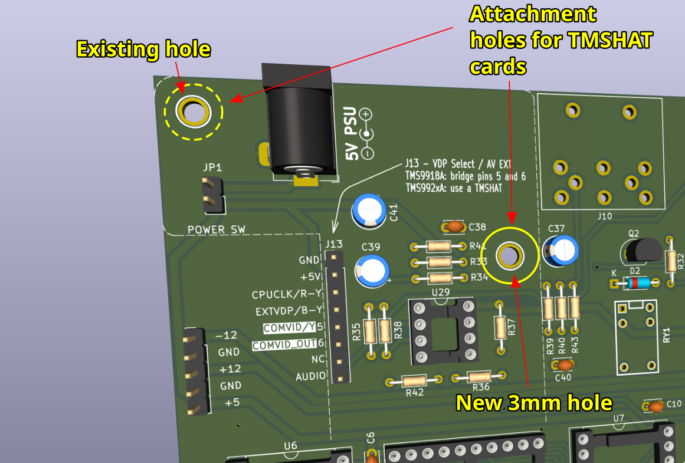

# JFF Computer with TMSHAT

> [!WARNING]
> This project is totally UNTESTED and as of today it has never been built!
> Do NOT build, unless you don't mind having some extra FR-4 paperweights.
>

This is an enhanced version of the [JFF Computer](https://github.com/konkotgit/JFF) by @Skoti, which enables the use of the TMS9928A or TMS9929A Video Display Processors (VDPs), in addition to the TMS9918A VDP.

## Motivation

The JFF Computer by @Skoti is a [MSX1 compatible computer](https://www.msx.org/wiki/MSX1) which uses the TMS9918A VDP which is part of the [TMS9918 family](https://en.wikipedia.org/wiki/TMS9918) of Video Display Processors from Texas Instruments.
The TMS9918A outputs a 60Hz composite NTSC video signal, and thus the JFF has a single RCA video output connector with a composite video signal.

The TMS9928A and TMS9929A VDPs, from the same family of Video Display Processors, output instead analog luminance (Y) and color difference (R-Y and B-Y) signals.
Except for the video output signals, the TMS9918A, TMS9928A and TMS9929A VDPs behave identically and have an almost identical pinout.

The difference in the pinout of the TMS9918A, TMS9928A and TMS9929A VDPs affects the following pins:

| **Pin Number** | **TMS9918A Name** | **TMS9918A Description**        | **TMS9928A/TMS9929A Name** | **TMS9928A/TMS9929A Description** |
| -------------- | ----------------- | ------------------------------- | -------------------------- | --------------------------------- |
| 35             | EXTVDP            | External VDP input              | B-Y                        | B-Y color difference output       |
| 36             | COMVID            | Composite video output          | Y                          | luminance/sync output             |
| 38             | CPUCLK            | VDP color burst frequency clock | R-Y                        | R-Y color difference output       |

Given that the JFF Computer does not use VDP pins 35 nor 38, and just uses pin 36 for composite video output, it should be relatively straightforward to allow the use of the TMS9928A or TMS9929A VDPs alternatively to the TMS9918A VDP.
Using the luminance and color difference signals provided by the TMS9928A or TMS9929A VDPs, an enhanced output video signal like RGB or component video can be generated for a better user experience.

## Proposed Changes

### Original JFF Computer mainboard (rev 1.1b)

### Modified JFF Computer mainboard (rev 1.1b-TMSHAT)

The JFF computer mainboard is modified as described here.

* An new audio/video header J13 is added to the JFF computer mainboard, which can be used to select between the TMS9918A or TMS9928A/TMS9929A VDPs, and to provide the required audio and video signals to an external companion card called TMSHAT which converts them into a specific audio/video output.

  

  The header consists of at least the following signals:
  * GND
  * +5V
  * CPUCLK/R-Y
  * EXTVDP/B-Y
  * COMVID/Y
  * COMVID_OUT
  * AUDIO

  A total of 8 pins are used for the audio/video header, giving 1 extra pin for future use.

  Allowed VDP configurations:

  - *TMS9918A*

    To use a TMS9918A VDP, pins 5 (COMVID/Y) and 6 (COMVID_OUT) of J13 must be bridged and a TMS9918A must be installed in U6.
    In this configuration the modified JFF computer works identically as the original JFF computer with a TMS9918A and outputs a composite video signal on the motherboard video RCA connector.

  - *TMS9928A/TMS9929A*

    To use a TMS9928A or TMS9929A VDP, a companion TMSHAT card needs to be connected to J13 and a TMS9928A or TMS9929A VDP must be installed in U6.
    In this configuration the modified JFF computer will provide an audio and video output according to the capabilities of the TMSHAT card connected.
    
* A small clearance area is defined between the power barrel connector and the DIN8 cassette connector in the JFF computer mainboard.

  

  This allows to, as long as they fit, seamlessly place in that area the additional audio/video connectors provided by the TMSHAT cards.
  Note that the additional audio/video connectors are never part of the JFF computer mainboard, they are instead soldered to the TMSHAT cards. But, for convenience, the mentioned area allows making such connectors available on the back of the JFF computer as if they were on the mainboard.

  The power led is relocated next to the Audio connector in the JFF computer motherboard to allow the described clearance.

  
  

* Enough clearance is preserved too for the DD1718PA +12V/-12V voltage module converter to be installed upside-down in the J5 header.

  

* A new extra 3mm hole is added to the JFF computer mainboard.

  

  A TMSHAT card must be properly attached to the JFF computer mainboard, specially as it has to deal with cable insertion/removal forces when audio/video connectors are present on the TMSHAT card itself.

  The top-left 3mm hole and the new 3mm hole on the JFF computer mainboard are the mechanical attachment points for the TMSHAT cards, while the audio/video header attachment provides the electrical signals.

* External companion TMSHAT cards are designed and connected to the new audio/video header to achieve a specific audio/video output.

  As an example, a pair of TMSHAT card implementations are provided to convert the luminance and color difference signals to RGB, and output both the audio and RGB video signals through a DIN8 connector compatible with audio/video cables for Panasonic MSX2+ machines.

  

## [Hardware](hardware/kicad/)

This project provides source files for the following hardware designs:

* JFF mainboard rev 1.1b-TMSHAT aka [JFF-TMSHAT-Mainboard](#jff-tmshat-mainboard)

* TMSHAT for RGB output using a standard TMS-RGBv2 module, aka [JFF-TMSHAT-Hat-TMSRGBv2](#jff-tmshat-hat-tmsrgbv2)

* TMSHAT for RGB output using a custom TMS-RGB implementation, aka [JFF-TMSHAT-Hat-TMSRGBCustom](#jff-tmshat-hat-tmsrgbcustom)

### JFF-TMSHAT-Mainboard

This mainboard design allows using a TMS9928A or TMS9929A VDP in combination with a TMSHAT, or a TMS9918A VDP by just closing a jumper.

#### [JFF-TMSHAT-Mainboard Build1](hardware/kicad/JFF-TMSHAT-Mainboard-Build1/)

[Bill Of Materials (BoM)](https://html-preview.github.io/?url=https://raw.githubusercontent.com/herraa1/JFF-TMSHAT/main/hardware/kicad/JFF-TMSHAT-Mainboard-Build1/jff_mainboard-1.1b-TMSHAT/bom/ibom.html)

### JFF-TMSHAT-Hat-TMSRGBv2

This TMSHAT provides RGB output via a DIN8 connector compatible with Panasonic MSX2+ machines when using a TMS9928A or TMS9929A VDP.

It requires a [TMS-RGB v2 module](https://tms-rgb.com/) by [Nicholas Piegdon](https://twitter.com/npiegdon).

#### [JFF-TMSHAT-Hat-TMSRGBv2 Build1](hardware/kicad/JFF-TMSHAT-Hat-TMSRGBv2-Build1/)

[Bill Of Materials (BoM)](https://html-preview.github.io/?url=https://raw.githubusercontent.com/herraa1/JFF-TMSHAT/main/hardware/kicad/JFF-TMSHAT-Hat-TMSRGBv2-Build1/bom/ibom.html)

### JFF-TMSHAT-Hat-TMSRGBCustom

This TMSHAT provides RGB output via a DIN8 connector compatible with Panasonic MSX2+ machines when using a TMS9928A or TMS9929A VDP.

It implements a custom TMS-RGB directly in the TMSHAT.

#### [JFF-TMSHAT-Hat-TMSRGBCustom-Build1](hardware/kicad/JFF-TMSHAT-Hat-TMSRGBCustom-Build1/)

[Bill Of Materials (BoM)](https://html-preview.github.io/?url=https://raw.githubusercontent.com/herraa1/JFF-TMSHAT/main/hardware/kicad/JFF-TMSHAT-Hat-TMSRGBCustom-Build1/bom/ibom.html)

## References

Skoti's JFF Computer
* https://github.com/konkotgit/JFF

## Image Sources

* https://www.oshwa.org/open-source-hardware-logo/
